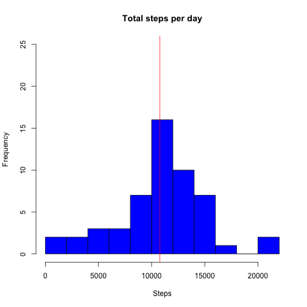
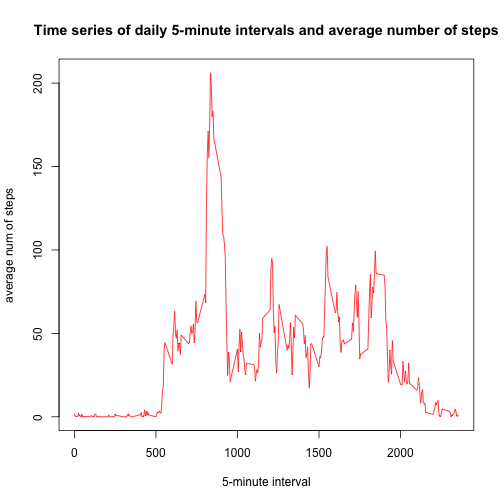
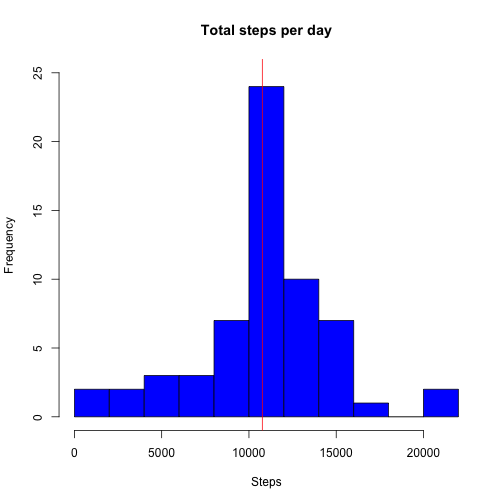
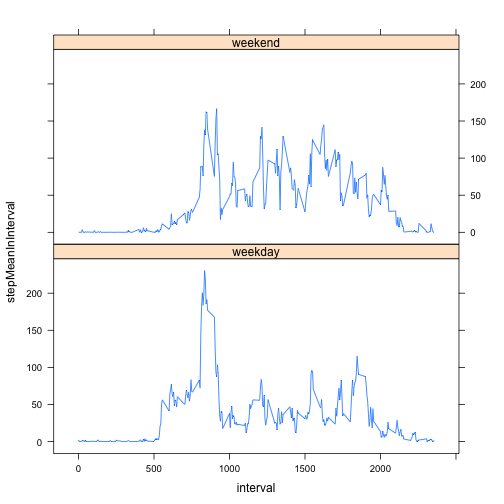

This is the R Markdown document for the Coursera Reproducible Research Assignment. The assignment makes use of dataset from from an anonymous individual's personal activity monitoring device for the months of October and November 2012. The data can be [download from the course website here](https://d396qusza40orc.cloudfront.net/repdata%2Fdata%2Factivity.zip).
This report provides a simple analysis using the data. 

## More about the data
The data is stored in a csv file. 
There are 17,568 observations (rows) in this dataset.
There are 3 variables (columns) collected for the device in this dataset. These are:  
* **steps**: the number of steps taken in a 5-minute interval. Missing values are coded as NA  
* **date**: the data in the format YYYY-MM-DD when the measurement was taken  
* **interval**: an identifer for the 5-minute interval when the measurement was taken  

Let's begin by loading the data

```r
activityData <- read.csv('activity.csv', stringsAsFactors=FALSE)
str(activityData)
```

```
## 'data.frame':	17568 obs. of  3 variables:
##  $ steps   : int  NA NA NA NA NA NA NA NA NA NA ...
##  $ date    : chr  "2012-10-01" "2012-10-01" "2012-10-01" "2012-10-01" ...
##  $ interval: int  0 5 10 15 20 25 30 35 40 45 ...
```

The dimensions of this dataset are 17568 rows and 3 columns. The colnames are steps, date, interval.

Take a quick look at the file

```r
head(activityData, 10)
```

```
##    steps       date interval
## 1     NA 2012-10-01        0
## 2     NA 2012-10-01        5
## 3     NA 2012-10-01       10
## 4     NA 2012-10-01       15
## 5     NA 2012-10-01       20
## 6     NA 2012-10-01       25
## 7     NA 2012-10-01       30
## 8     NA 2012-10-01       35
## 9     NA 2012-10-01       40
## 10    NA 2012-10-01       45
```

## The mean number of steps taken per day (ignoring the missing value in the dataset)
The total number of steps taken per a day 

```r
dailySteps <- aggregate(cbind(activityData$steps) ~ activityData$date, activityData, sum)
# rename second column to steps 
colnames(dailySteps)[2] = 'steps'
```
Draw a histogram of the daily mean steps distribution. The mean value is given as a red line. 

```r
hist(dailySteps$steps,10, main="Total steps per day", xlab="Steps", ylab="Frequency", ylim=c(0,25), col="blue")
abline(v=mean(dailySteps$steps),col="red")
```

 

The mean of the total number of steps taken per day is 1.077 &times; 10<sup>4</sup> and the median is 1.076 &times; 10<sup>4</sup>.

## The average daily activity pattern (ignoring the missing value in the dataset)
Group the data to find the average number of steps taken in a 5-minute interval per a day

```r
dailyTimeSeries <- aggregate(cbind(activityData$steps) ~ activityData$interval, activityData, mean)
colnames(dailyTimeSeries)[2] = 'steps'
colnames(dailyTimeSeries)[1] = 'interval'
```
Make a timeseries plot of the 5-minute interval and the average number of steps taken daily

```r
plot(x=dailyTimeSeries$interval, y=dailyTimeSeries$steps, type="l",xlab="5-minute interval", ylab="average num of steps", main="Time series of daily 5-minute intervals and average number of steps", col="red")
```

 

Take a look at the first 10 time intervals in the average 5-minute interval

```r
head(dailyTimeSeries,10)
```

```
##    interval     steps
## 1         0 1.7169811
## 2         5 0.3396226
## 3        10 0.1320755
## 4        15 0.1509434
## 5        20 0.0754717
## 6        25 2.0943396
## 7        30 0.5283019
## 8        35 0.8679245
## 9        40 0.0000000
## 10       45 1.4716981
```
The average 5-minute interval with the maximum number of steps daily is 835. This was found executing the code below.

```r
rbind(dailyTimeSeries[dailyTimeSeries$steps==max(dailyTimeSeries$steps),1])
```

```
##      [,1]
## [1,]  835
```

## Imputing missing values
As the missing values in the dataset may introduce biases in some calculations, in this section the presence of missing values will be acknowledged in calculations. The missing data will be filled in using the average of the available data for a given 5-minute time interval.

The number of incomplete rows of observations is 

```r
dim(activityData)[1] - sum(complete.cases(activityData))
```

```
## [1] 2304
```

Closer investigation to determine the columns where data is missing data can be done as below. 
For the variable date:

```r
dim(activityData)[1] - sum(complete.cases(activityData$date))
```

```
## [1] 0
```

For the variable interval:

```r
dim(activityData)[1] - sum(complete.cases(activityData$interval))
```

```
## [1] 0
```

For the variable steps:

```r
dim(activityData)[1] - sum(complete.cases(activityData$steps))
```

```
## [1] 2304
```
This is 13.11% of the data, which is quite significant. The only missing values in the table are for the variable steps. These will be filled in with the mean number of steps for the specific 5-minute interval of the other days where that data is avaiable.


```r
newActivityData <- activityData
for (i in 1:length(newActivityData$steps)) {
    if (is.na(newActivityData[i,1]))
        newActivityData[i,1] <- dailyTimeSeries[dailyTimeSeries$interval==newActivityData[i,3],2];
}
```

Take a look at the first 10 observations of the new dataset

```r
head(newActivityData,10)
```

```
##        steps       date interval
## 1  1.7169811 2012-10-01        0
## 2  0.3396226 2012-10-01        5
## 3  0.1320755 2012-10-01       10
## 4  0.1509434 2012-10-01       15
## 5  0.0754717 2012-10-01       20
## 6  2.0943396 2012-10-01       25
## 7  0.5283019 2012-10-01       30
## 8  0.8679245 2012-10-01       35
## 9  0.0000000 2012-10-01       40
## 10 1.4716981 2012-10-01       45
```

The dimensions of the new dataset are 17568 rows and 3 columns. The colnames are steps, date, interval. There are 0 missing values (NA) in this new dataset. 

A histogram of the total daily steps of the imputed data. The mean value is given as a red line. 

```r
newDailySteps <- aggregate(cbind(newActivityData$steps) ~ newActivityData$date, newActivityData, sum)
# rename second column to steps 
colnames(newDailySteps)[2] = 'steps'
hist(newDailySteps$steps,10, main="Total steps per day", xlab="Steps", ylab="Frequency", ylim=c(0,25), col="blue")
abline(v=mean(newDailySteps$steps),col="red")
```

 

The mean of the total number of steps taken per day is 

```r
round(summary(newDailySteps$steps)[4],2)
```

```
##  Mean 
## 10770
```
and the median is 

```r
round(summary(newDailySteps$steps)[3],2)
```

```
## Median 
##  10770
```
The values for the mean and median are for the imputed data are similarly distributed. More specifically, the change in the mean is given as

```r
round(summary(dailySteps$steps)[4],2) - round(summary(newDailySteps$steps)[4],2)
```

```
## Mean 
##    0
```
and the median as

```r
round(summary(dailySteps$steps)[3],2) - round(summary(newDailySteps$steps)[3],2)
```

```
## Median 
##    -10
```
indicating an increase in the median value for the imputed dataset. 

## Weekday and weekend differences
First append a new column indicating the type of day of the week - weekday or weekend - onto the imputed dataset. 


```r
dayOfWeek <- function(date) {
    if (weekdays(as.Date(date)) %in% c("Saturday", "Sunday")) {
        "weekend"
    } else {
        "weekday"
    }
}
newActivityData$daytype <- as.factor(sapply(newActivityData$date, dayOfWeek))
head(newActivityData)
```

```
##       steps       date interval daytype
## 1 1.7169811 2012-10-01        0 weekday
## 2 0.3396226 2012-10-01        5 weekday
## 3 0.1320755 2012-10-01       10 weekday
## 4 0.1509434 2012-10-01       15 weekday
## 5 0.0754717 2012-10-01       20 weekday
## 6 2.0943396 2012-10-01       25 weekday
```
Create a timeseries plot of the 5-minute interval and the average number steps taken averaged on weekdays and weekends.

```r
library(plyr)
library(lattice)
stepsTypeOfDay <- ddply (newActivityData,.(interval, daytype), summarize, 
              stepMeanInInterval = mean(steps, na.rm=TRUE))
xyplot(stepMeanInInterval ~ interval | daytype, data=stepsTypeOfDay, type='l', layout=c(1,2))
```

 
